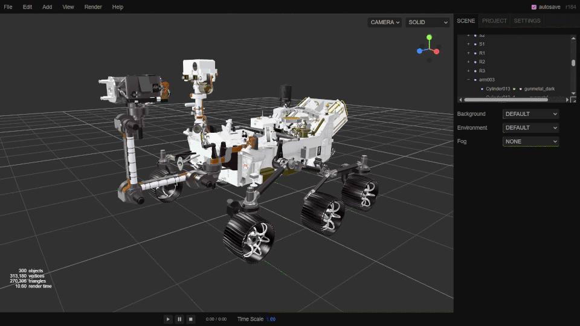

SUPSI 2026  
Corso d’interaction design, CV429.01  
Docenti: A. Gysin, G. Profeta  

Progetto 1: La conquista dello spazio

# NASA - Perseverance Rover
Autore: Nahele Belli \
[NASA - Perseverance Rover](https://naheleee.github.io/Progetto_1_PerseveranceRover/)


## Introduzione e tema
Il progetto consiste in un sitoweb interattivo dedicato all'esplorazione del Rover "Perseverance" e la missione NASA Mars 2020. L'obiettivo è colmare il divario tra la complessità dell'ingegneria aerospaziale e la divulgazione scientifica, offrendo un'esperienza immersiva che permette di analizzare da vicino uno dei veicoli più avanzati mai inviati su un altro pianeta.


## Riferimenti progettuali
Lo sviluppo si è basato sull'analisi del sito originale della Nasa ([nasa.gov/mission/mars-2020-perseverance](https://science.nasa.gov/mission/mars-2020-perseverance/)) e Three.js, libreria JavaScript che rende facile e accessibile la creazione di computer grafica 3D all'interno di un browser web:
Editor Three.js ([three.js/editor](https://threejs.org/editor/))


## Design dell’interfaccia e modalità di interazione
L'interfaccia è stata progettata seguendo i principi del Minimalist Design, con un approccio "Game-like" per massimizzare il coinvolgimento. Invece di menu complessi, l'utente interagisce direttamente con il modello tramite controlli orbitali (zoom, rotazione, pan), rendendo l'esplorazione naturale sia per esperti che per neofiti. Si dispone anche di una serie di bottoni che portano a viste preimpostate per la visualizzazione di componentistica e curiosità in modo facile e semplice.

[]()


## Tecnologia usata
Three.js: Utilizzato per il rendering in tempo reale del modello 3D (.GLTF), gestendo geometrie complesse e texture ad alta risoluzione senza l'ausilio di plugin esterni. La libreria permette anche una gestione fluida di luci, ombre e materiali fisici.
<br>
Rigging e Articolazi in Blender: Per rendere il Rover dinamico e non solo una mesh statica, è stato eseguito il rigging all'interno di Blender. È stata creata un'armatura (skeleton), con una gerarchia di "ossa" che rispecchia la meccanica reale del veicolo (braccio robotico, torretta e sistema di sterzo).

[]()


```JavaScript
// Esempio di rotazione del braccio robotico (Rigging)
function rotateRoverArm(angle) {
    // Selezioniamo il nodo del braccio nel modello GLTF
    const armPivot = roverModel.getObjectByName('Arm_Joint_01');
    
    // Applichiamo una rotazione sull'asse Y
    armPivot.rotation.y = THREE.MathUtils.lerp(
        armPivot.rotation.y, 
        angle, 
        0.1 // Interpolazione per movimento fluido
    );
}

// Funzione per impostare la vista Default
function setViewDefault() {
    const defaultPos = { x: 5, y: 3, z: 10 };
    const targetLookAt = new THREE.Vector3(0, 1, 0);

    // Animazione della camera verso la posizione predefinita
    gsap.to(camera.position, {
        duration: 2,
        x: defaultPos.x,
        y: defaultPos.y,
        z: defaultPos.z,
        onUpdate: () => camera.lookAt(targetLookAt)
    });
    controls.target.copy(targetLookAt);
}
```

## Target e contesto d’uso
16 - 50+, Giovani, adulti, e curiosi. Il progetto si rivolge a un pubblico eterogeneo, che spazia dagli studenti agli appassionati di tecnologia.
